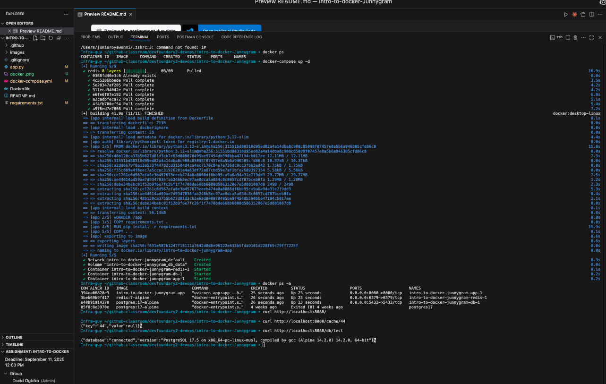

[](https://classroom.github.com/a/q10YQZa2)
[](https://classroom.github.com/online_ide?assignment_repo_id=20425321&assignment_repo_type=AssignmentRepo)

# Introduction to Docker Assignment

For this assignment, you have a broken `app.py` file. You have to carry out the following to fix the file and application:

- Ensure the `redis` initialization works properly.
- Add error checks to the redis get and set endpoints in your app
- Use the postgres database in your application
- Ensure that a `docker compose up -d` run spins up:
  - The fastapi app
  - The redis cache
  - The postgres db.

You are free to use whatever resources available to you in solving this
task. All that is required is a fully functional docker compose application.

## Assignment Completed!



### What I Accomplished:

✅ **Fixed Redis initialization** - Added proper error handling and connection testing  
✅ **Added error checks** - Implemented comprehensive error handling for Redis get/set endpoints  
✅ **Integrated PostgreSQL** - Connected the application to use PostgreSQL database  
✅ **Docker Compose setup** - Created a fully functional multi-container application

### Services Running:

- **FastAPI App** (Port 8080) - Main application with Redis and PostgreSQL integration
- **Redis Cache** (Port 6379) - For caching operations
- **PostgreSQL DB** (Port 5432) - Database with persistent storage

### Quick Start:

```bash
docker compose up -d
```

### API Endpoints:

- `GET /` - Welcome message
- `GET /cache/{key}` - Retrieve cached value
- `POST /cache/{key}/{value}` - Store value in cache
- `GET /db/test` - Test database connection

All services are properly configured with error handling and work together seamlessly! 🚀
